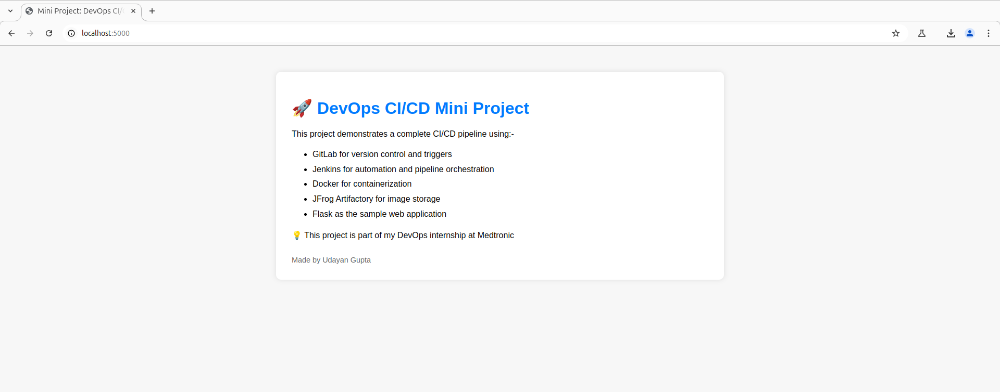
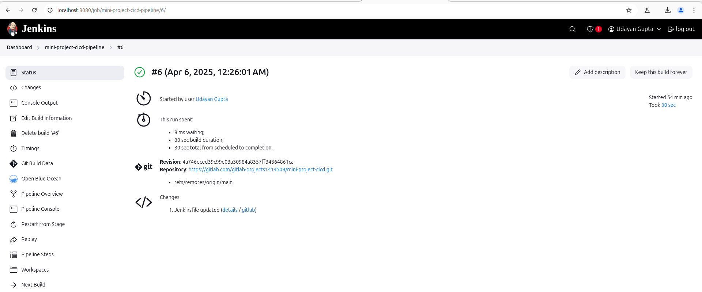
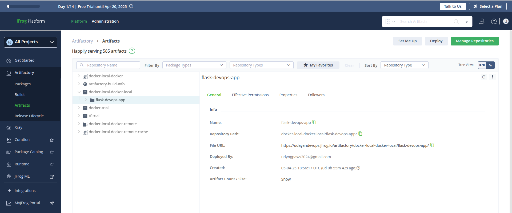
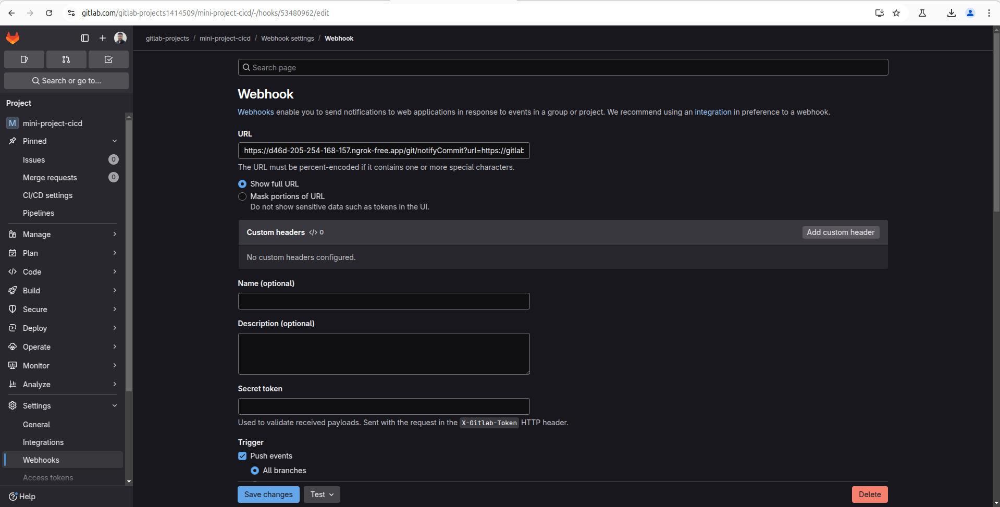

# 🚀 Mini Project 1: DevOps CI/CD Pipeline with Flask, Jenkins, Docker & JFrog

This mini project demonstrates a complete CI/CD pipeline that automatically builds, tests, and deploys a simple Flask web application using modern DevOps tools.

It is part of my DevOps internship at **Medtronic Engineering and Innovation Centre**, under the Shared Services team.

---

## 📌 Project Overview

This project showcases:

- A simple **Flask-based Python web app**
- A **Dockerized** deployment setup
- A **CI/CD pipeline** configured using **Jenkins**
- Integration with **GitLab** for source code management and triggering builds
- **JFrog Artifactory** as a Docker image repository

---

## 🧱 Tech Stack

| Tool/Service      | Purpose                       |
| ----------------- | ----------------------------- |
| GitLab            | Source control & CI trigger   |
| Jenkins           | CI/CD pipeline automation     |
| Docker            | Containerization              |
| Flask             | Lightweight web app framework |
| JFrog Artifactory | Docker image repository       |

---

## 🗂️ Project Structure

```
mini-project-1-ci-cd/
├── app/
│   ├── app.py              # Flask app with homepage content
│   ├── requirements.txt    # Python dependencies
│   └── Dockerfile          # Container image definition
├── Jenkinsfile             # CI/CD pipeline script
└── README.md               # Project documentation
```

---

## 🌐 Flask App Overview

The homepage (`/`) displays a styled HTML page summarizing:

- Tools used in this CI/CD pipeline
- Project description and context
- A personal touch (your name, internship note, etc.)

✅ Simple, clean, and effective for demo purposes.

---

## ⚙️ How the CI/CD Pipeline Works

1. Code is pushed to the GitLab repository (`main` branch)
2. GitLab webhook triggers a Jenkins pipeline job
3. Jenkins:
   - Clones the GitLab repo
   - Optionally installs dependencies for testing
   - Builds a Docker image using the `app/Dockerfile`
   - Pushes the image to **JFrog Artifactory**
4. Output logs and results can be monitored in Jenkins

---

## 🐳 Docker Image

The image is tagged as `flask-devops-app:latest` and pushed to:

```
https://your-subdomain.jfrog.io/artifactory/docker-local
```

---

## 🚀 Running the App Locally

1. Build the image:

   ```bash
   docker build -t flask-devops-app ./app
   ```

2. Run the container:

   ```bash
   docker run -p 5000:5000 flask-devops-app
   ```

3. Visit:
   ```
   http://localhost:5000
   ```

---

## 🧪 Test the Pipeline

1. Make a change (e.g., edit `app.py`)
2. Commit and push to GitLab:
   ```bash
   git add .
   git commit -m "Update homepage"
   git push origin main
   ```
3. Watch Jenkins trigger the job and follow each stage (Build → Push to JFrog)

---

## 📷 Project Screenshots

### Flask App Homepage



### Jenkins Pipeline Success



### Docker Image in JFrog



### GitLab Webhook Setup



---

## 📌 Notes

- Virtual environment (`venv/`) is used for local testing only and excluded from Git tracking.
- `.gitignore` ensures clean version control.

---

## 🙌 Acknowledgements

Special thanks to the team at **Medtronic Engineering and Innovation Centre** for the guidance and opportunity to explore DevOps tools in real-world scenarios.

---

## ✍️ Author

**Udayan Gupta**  
DevOps Intern, Medtronic Engineering and Innovation Centre, Hyderabad
